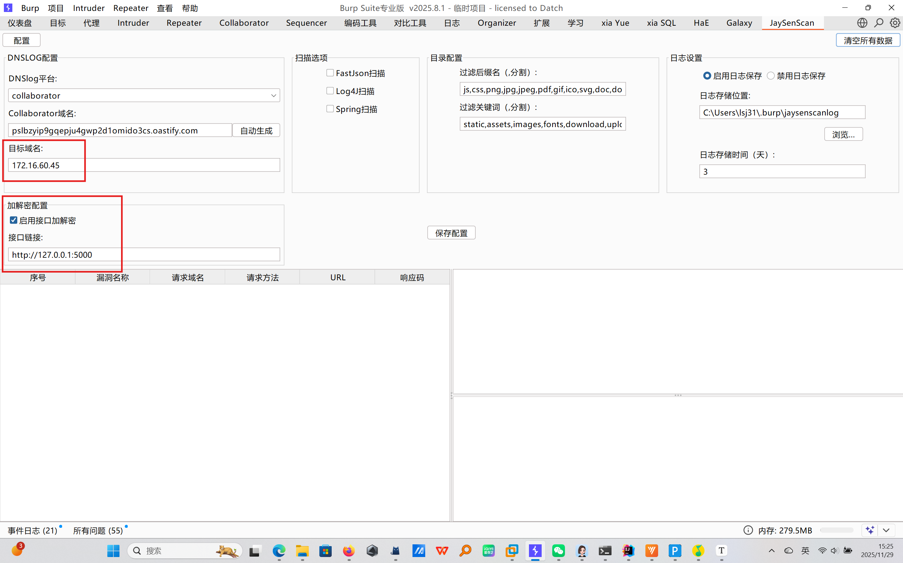
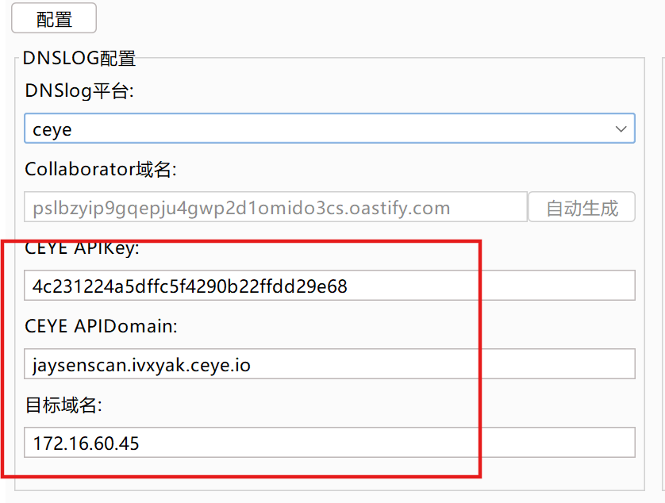

# JaySenScan

一款基于Burp Suite 2025.8 API开发的集成高危漏洞检测与接口加解密能力的插件，专注于提升Web安全渗透测试的效率与灵活性。

## 开发思想

各位师傅在项目上时，是否遇到以下情景？

1、目标HTTP流量被加解密，存在数据包sgin校验、请求参数等多个点的复杂加密等

2、想在Repeater、Intruder模块明文测试加密数据包

3、由于客户特殊性，防止误伤其他域名，急需指定自动漏洞扫描的目标域名

4、数据包是加密的，自动扫描的log4j等payload要按照要求自动加密后攻击

5、想使用sqlmap、xray等安全攻击对目标漏洞扫描，但是目标是加密的

6、插件太多，想轻量化

7、想要保存一定实践的漏扫记录，便于查询

本人在上面问题苦恼许久，于是秉持该想法，开发了该插件

本插件基于以上问题做出解决，集成流量加解密、漏洞扫描与一体的插件


## 主要功能

**自动化加解密**：插件自动化通过自定义的接口自动化加解密，支持Burp的所有模块

**高危漏洞扫描：**目前支持扫描Fastjson反序列化、log4j反序列化、spring扫描，当然若勾选了自动加解密也会自动加密payload后扫描

**安全工具联动：**可以联动xray、sqlmap等任意自动化攻击工具


## 使用方式（首次使用必读）

### 自动加解密

#### 原理

如下图是一个数据包在经过burp后的整个历程

> 1、客户端先将加密的请求数据传递到burp上
>
> 2、burp将加密的请求数据传递到服务器
>
> 3、服务器返回加密后的响应数据给burp
>
> 4、burp将加密的响应数据传递给客户端


自动加解密的原理就是将数据包传递的4个动作内进行hook，将输入包交给用户自定义修改（加解密）

**第一步：**提供RequestReceived接口处理客户端到burp的数据包

**第二步：**提供RequestToBeSent接口处理burp到服务器的数据包

**第三步：**提供ResponseReceived接口处理服务器到burp的数据包

**第四步：**提供ResponseToBeSent接口处理burp到浏览器的数据包


#### 1、配置插件

**勾选启用加解密：**首先在插件配置上勾选启用插件

**配置接口路径：**例如http://127.0.0.1:5000，

**配置好目标域名：**二级域名即可，例如目标可能变化为a.baidu.com、b.baidu.com只需配置为baidu.com，*或置空表示所有目标

**保存配置：**配置完成点击保存配置即可



#### 2、配置加解密接口

提供的如下两个python文件为提供加解密的接口脚本


__jaysendata.py文件是定义数据结构的，不用修改，了解数据结构即可

```python

# 定义请求数据类型
@dataclass
class JaysenReqData:
    # 请求方法（GET/POST等）
    method: str
    # 完整请求参数和值
    paramters: Dict[str,str]
    # 请求头（字典格式，key为头名称，value为头值）
    headers: Dict[str, str]
    # 请求体（GET请求为空字符串，POST/PUT可能有内容）
    body: str

# 定义响应数据类型
@dataclass
class JaysenRespData:
    # 响应头（字典格式，key为头名称，value为头值）
    headers: Dict[str, str]
    # 响应体
    body: str
```


jaysenscan.py是创造http服务，提供加解密的文件

```python
from flask import Flask, request, jsonify
from __jaysendata import JaysenReqData,JaysenRespData
app = Flask(__name__)

# 对请求数据包进行解密操作
@app.route('/RequestReceived', methods=['POST'])
def request_received():
    request_json = request.get_json()
    # 初始化原始数据
    jaysendata = JaysenReqData(
        method=request_json.get("method", ""),
        paramters=request_json.get("paramters", {}),
        headers=request_json.get("headers", {}),
        body=request_json.get("body", ""),
    )
# ===============================在此区域对请求数据包进行加密========================================


#==============================================================================================
    # 返回修改后的数据包
    return jsonify(jaysendata)

# 对解密后的请求进行加密操作
@app.route('/RequestToBeSent', methods=['POST'])
def handle_request():
    request_json = request.get_json()
    # 初始化原始数据
    jaysendata = JaysenReqData(
        method=request_json.get("method", ""),
        paramters=request_json.get("paramters", {}),
        headers=request_json.get("headers", {}),
        body=request_json.get("body", ""),
    )
# ===============================在此区域对请求数据包进行解密还原========================================

# ==============================================================================================
    # 返回修改后的数据包
    return jsonify(jaysendata)

# 解密响应数据包
@app.route('/ResponseReceived', methods=['POST'])
def ResponseReceived():
    resp_json = request.get_json()
    jaysendata = JaysenRespData(
        headers=resp_json.get("headers"),
        body=resp_json.get("body")
    )
# ===============================在此区域对响应数据包进行解密========================================

# ==============================================================================================
    # 返回修改后的数据包
    return jsonify(jaysendata)

#加密响应数据包
@app.route('/ResponseToBeSent', methods=['POST'])
def ResponseToBeSent():
    resp_json = request.get_json()
    jaysendata = JaysenRespData(
        headers=resp_json.get("headers"),
        body=resp_json.get("body")
    )
# ===============================在此区域对响应数据包进行加密还原========================================

# ==============================================================================================
    # 不修改响应包
    return jsonify(jaysendata)

if __name__ == '__main__':
    app.run(host='127.0.0.1', port=5000, debug=True)
```


只需要在使用#=================框起来的部分对数据包进行加解密操作即可


### 漏洞扫描

#### 1、配置插件




DNSlog这里可以选择自带的Collaborator和CEYE，选择Collaborator时，记得点击自动生成域名，**（！！注意：社区版不支持Collaborator）**，配置好后一定点击保存配置即可


#### 2、Spring扫描

spring扫描也可叫接口扫描，它会自动匹配自定义需要扫描的接口并进行递归扫描，例如/api/a/b/c路径会扫描/api/a/b/c、/api/a/b、/api/a/、/api/、/路径并且存在5分钟扫描控制，避免5分钟内重复扫描同一路径

勾选spring扫描后需要配置目录配置内的Spring扫描配置


**扫描目录关键词：**比如请求path中包含该路径就执行扫描，否则不执行


