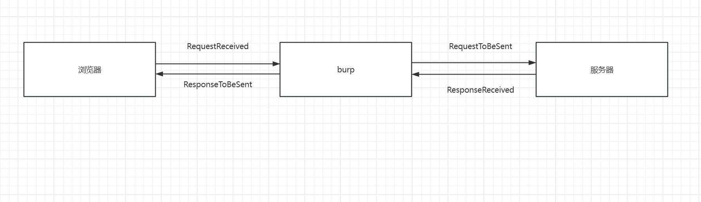
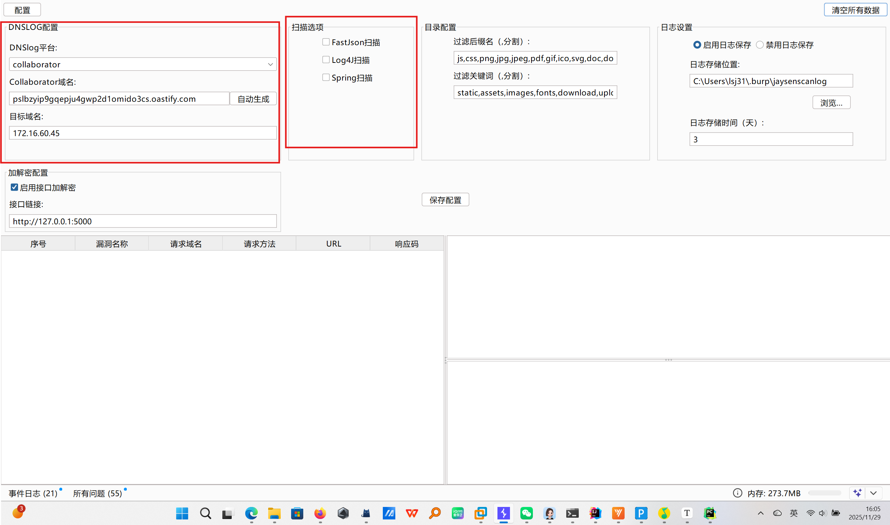
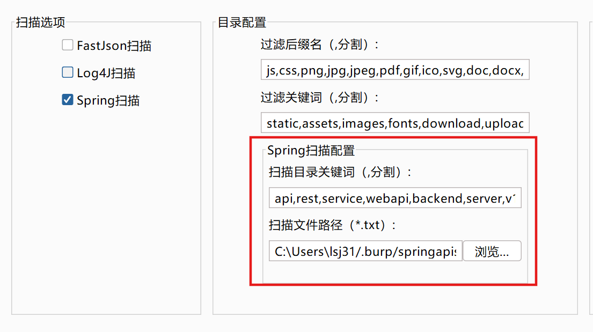
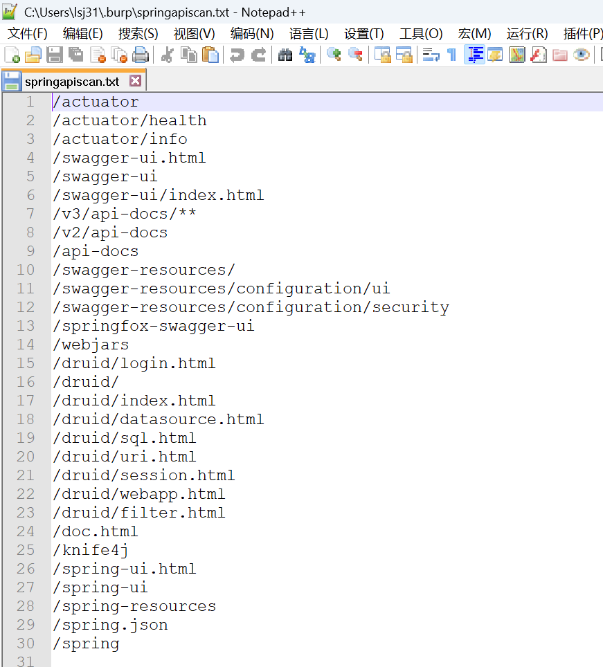
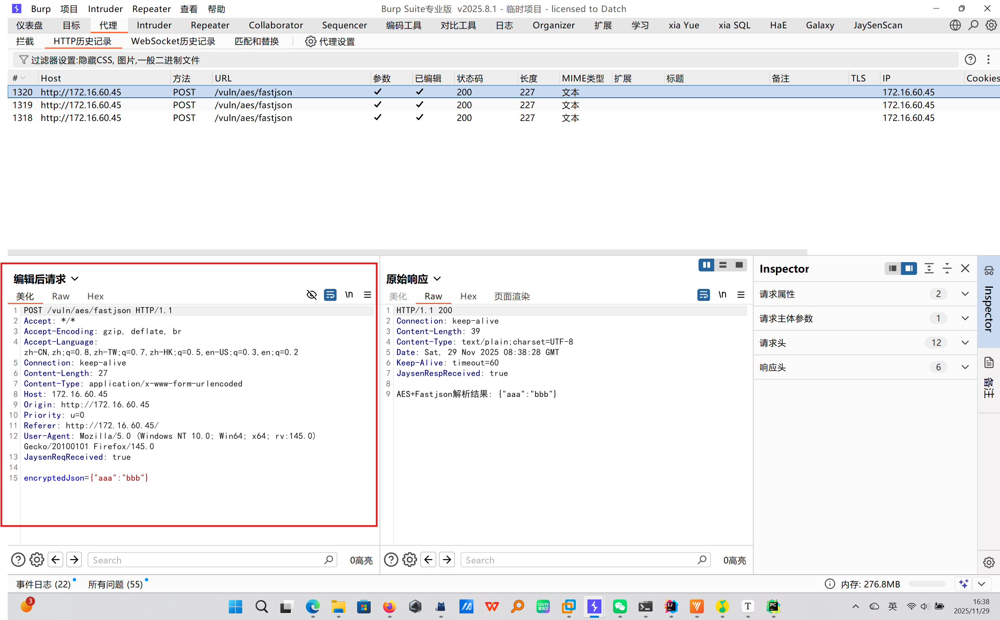

# JaySenScan

一款基于 Burp Suite 2025.8 API 开发的插件，集成高危漏洞检测与接口加解密能力，专注于提升 Web 安全渗透测试的效率与灵活性。


## 开发背景

在渗透测试过程中，您是否常遇到这些痛点？

- 目标 HTTP 流量加密，存在签名校验、参数加密等复杂场景
- 希望在 Repeater/Intruder 模块用明文编辑加密数据包
- 需要精准指定漏洞扫描的目标域名，避免误扫
- 加密环境下，扫描 payload 需自动加密后才能生效
- 无法直接使用 sqlmap、xray 等工具扫描加密目标
- 插件过多导致 Burp 运行卡顿，需要轻量化解决方案
- 需留存漏扫记录以便后续查询与复盘

针对以上问题，JaySenScan 应运而生，将流量加解密与漏洞扫描功能集成一体，简化加密环境下的渗透测试流程。


## 核心功能

### 🔑 自动化加解密

- 全模块支持：覆盖 Burp Proxy/Repeater/Intruder 等所有模块
- 自定义接口：通过 HTTP 接口实现灵活的加解密逻辑
- 无缝体验：明文编辑、加密传输，无需手动转换

### 🔍 高危漏洞扫描

- 内置检测：支持 Fastjson 反序列化、Log4j 反序列化、Spring 接口扫描
- 智能适配：加密环境下自动对 payload 进行加密处理
- 防重机制：5 分钟内避免重复扫描同一目标，减少冗余请求

### 🔗 安全工具联动

- 兼容主流工具：与 sqlmap、xray 等无缝对接
- 解决加密障碍：工具发送的 payload 经插件自动加密后发送


## 使用指南（首次使用必读）

### 自动加解密

#### 原理说明

数据包在 Burp 中的流转流程如下：

1. 客户端 → Burp（加密请求）
2. Burp → 服务器（加密请求）
3. 服务器 → Burp（加密响应）
4. Burp → 客户端（加密响应）



插件通过 hook 以上 4 个节点实现自动化加解密：

- **RequestReceived**：处理客户端到 Burp 的加密请求（解密）
- **RequestToBeSent**：处理 Burp 到服务器的明文请求（加密）
- **ResponseReceived**：处理服务器到 Burp 的加密响应（解密）
- **ResponseToBeSent**：处理 Burp 到客户端的明文响应（加密）


#### 配置步骤

1. **插件基础配置**

   - 勾选"启用加解密"
   - 填写加解密接口地址（例如 `http://127.0.0.1:5000`）
   - 配置目标域名（二级域名，如 `baidu.com`；`*` 或空表示所有域名）
   - 点击"保存配置"生效

   


2. **加解密接口实现**
   需自行实现 HTTP 服务处理加解密逻辑，提供两个参考文件：

   - `__jaysendata.py`（数据结构定义，无需修改）

   ```python
   from dataclasses import dataclass
   from typing import Dict
   
   # 请求数据结构
   @dataclass
   class JaysenReqData:
       method: str                  # 请求方法（GET/POST等）
       paramters: Dict[str, str]    # 请求参数
       headers: Dict[str, str]      # 请求头
       body: str                    # 请求体
   
   # 响应数据结构
   @dataclass
   class JaysenRespData:
       headers: Dict[str, str]      # 响应头
       body: str                    # 响应体
   ```

   - `jaysenscan.py`（HTTP 服务示例，需在指定区域编写加解密逻辑）

   ```python
   from flask import Flask, request, jsonify
   from __jaysendata import JaysenReqData, JaysenRespData
   app = Flask(__name__)
   
   # 客户端→Burp：解密请求
   @app.route('/RequestReceived', methods=['POST'])
   def request_received():
       jaysendata = JaysenReqData(**request.get_json())
       # ============================编写解密逻辑============================
       # 示例：jaysendata.body = aes_decrypt(jaysendata.body)
       # ==================================================================
       return jsonify(jaysendata)
   
   # Burp→服务器：加密请求
   @app.route('/RequestToBeSent', methods=['POST'])
   def handle_request():
       jaysendata = JaysenReqData(** request.get_json())
       # ============================编写加密逻辑============================
       # 示例：jaysendata.body = aes_encrypt(jaysendata.body)
       # ==================================================================
       return jsonify(jaysendata)
   
   # 服务器→Burp：解密响应
   @app.route('/ResponseReceived', methods=['POST'])
   def ResponseReceived():
       jaysendata = JaysenRespData(**request.get_json())
       # ============================编写解密逻辑============================
       # ==================================================================
       return jsonify(jaysendata)
   
   # Burp→客户端：加密响应
   @app.route('/ResponseToBeSent', methods=['POST'])
   def ResponseToBeSent():
       jaysendata = JaysenRespData(** request.get_json())
       # ============================编写加密逻辑============================
       # ==================================================================
       return jsonify(jaysendata)
   
   if __name__ == '__main__':
       app.run(host='127.0.0.1', port=5000, debug=True)
   ```

   > 提示：仅需在 `#=================` 标记区域编写加解密逻辑，任意语言都可以，只要能这四个接口


### 漏洞扫描

#### 基础配置

1. 配置 DNSlog 服务（支持 Burp Collaborator 或 CEYE）
   - 专业版 Burp 可使用 Collaborator（需点击"自动生成域名"）
   - 社区版需使用 CEYE 并填写 API 信息
2. 勾选需要启用的漏洞扫描类型（Fastjson/Log4j/Spring）
3. 点击"保存配置"




#### Spring 接口扫描

1. 配置扫描触发条件：路径包含指定关键词时执行扫描
2. 扫描路径文件：默认路径为 `C:\Users\$USER\.burp\springapiscan.txt`（内置常用路径）
3. 递归扫描：例如 `/api/a/b/c` 会触发 `/api/a/b/c`、`/api/a/b`、`/api/a`、`/api`、`/` 的扫描
4. 防重机制：5 分钟内不重复扫描同一路径





## 实战示例

提供专用靶场 [jaysenscandemo](https://github.com/Jaysen13/jaysenscandemo)，内置 5 个典型漏洞场景，帮助快速掌握插件使用。


### 1. AES 加密的 Fastjson 漏洞检测

1. 启动靶场配套的 `Aes_FastJson.py` 加解密服务
2. 插件配置接口地址为 `http://127.0.0.1:5000`
3. 发送测试请求，Burp 自动解密显示明文
4. 插件自动生成加密后的检测 payload，通过 DNSlog 验证漏洞




### 2. AES 加密的 Log4j 漏洞检测

1. 启动 `Aes_Log4j.py` 加解密服务
2. 发送含触发字符的请求，插件自动解密
3. 插件生成加密后的 Log4j payload 进行检测
4. 通过 DNSlog 监控命中情况确认漏洞


### 3. 联动 sqlmap 检测加密 SQL 注入

1. 启动 `Aes_Sql.py` 加解密服务

2. 抓取登录请求，获取解密后的明文数据

3. 将明文请求保存为 `data.txt`，通过 Burp 代理启动 sqlmap：

   ```shell
   python sqlmap.py -r data.txt --proxy=http://127.0.0.1:8080
   ```

4. sqlmap 发送的 payload 经插件自动加密，成功检测出注入点


## 实用技巧

- 开启 Burp "显示编辑后的数据"选项，直接查看解密内容（如图）
  
- 加解密接口支持 Java/Go/Node.js 等任意语言，只需保持 JSON 格式一致
- 扫描记录自动留存，可在插件历史面板查询


## 常见问题

- **Q：加解密接口必须用 Python 吗？**  
  A：不需要，支持任何语言，只要实现相同的 HTTP 接口即可。

- **Q：社区版 Burp 能否使用？**  
  A：可以，但不支持 Burp Collaborator，需配置 CEYE 作为 DNSlog 服务。

- **Q：后续漏洞检测模块还会扩展吗？**  
  A：会的，师傅们可以留言


## 作者与反馈

### 👨‍💻 作者信息

- 作者：JaySen
- 邮箱：3147330392@qq.com
- GitHub：[Jaysen13/JaySenScan](https://github.com/Jaysen13/JaySenScan)
- Gitee:[jaysen13/jaysenscan](https://gitee.com/qiudaoyu_liao/jaysenscan)

### 📬 反馈与贡献

- 若遇到 Bug 或有功能建议，欢迎提交 GitHub Issue
- 插件持续迭代中，后续将支持更多漏洞类型检测

### 📄 许可证

本项目基于 CC BY-NC-SA 4.0 许可证开源：允许非商业使用、修改、分发（需保留原作者声明），**禁止任何形式的商业售卖**（含二开版本）。
