# JaySenScan

[🇺🇸 English](README.md) | [🇨🇳 简体中文](README_CN.md)

一款基于 Burp Suite 2025.8 API 开发的插件，集成高危漏洞检测与接口加解密能力，专注于提升 Web 安全渗透测试的效率与灵活性。

[](https://github.com/jaysen13/jaysenscan/releases)


## 开发背景

在渗透测试过程中，您是否常遇到这些痛点？

- 目标 HTTP 流量加密，存在签名校验、参数加密等复杂场景
- 希望在 Repeater/Intruder 模块用明文编辑加密数据包
- 需要精准指定漏洞扫描的目标域名，避免误扫
- 加密环境下，扫描 payload 需自动加密后才能生效
- 无法直接使用 sqlmap、xray 等工具扫描加密目标
- 插件过多导致 Burp 运行卡顿，需要轻量化解决方案
- 需留存漏扫记录以便后续查询与复盘

针对以上问题，JaySenScan 应运而生，将流量加解密与漏洞扫描功能集成一体，简化加密环境下的渗透测试流程。


## 核心功能

### 🔑 自动化加解密

- 全模块支持：覆盖 Burp Proxy/Repeater/Intruder 等所有模块
- 自定义接口：通过 HTTP 接口实现灵活的加解密逻辑
- 无缝体验：明文编辑、加密传输，无需手动转换

### 🔍 高危漏洞扫描

- 内置检测：支持 Fastjson 反序列化、Log4j 反序列化、Spring 接口未授权访问、Shiro 反序列化（550/721）、Shiro 权限绕过
- 智能适配：加密环境下自动对 payload 进行加密处理
- 防重机制：5 分钟内避免重复扫描同一目标，减少冗余请求

### 🔗 安全工具联动

- 兼容主流工具：与 sqlmap、xray 等无缝对接
- 解决加密障碍：工具发送的 payload 经插件自动加密后发送

## 加解密功能演示

### 自动加解密


### 联动sqlmap


## 使用指南（首次使用必读）

### 自动加解密

#### 原理说明

数据包在 Burp 中的流转流程如下：

1. 客户端 → Burp（加密请求）
2. Burp → 服务器（加密请求）
3. 服务器 → Burp（加密响应）
4. Burp → 客户端（加密响应）

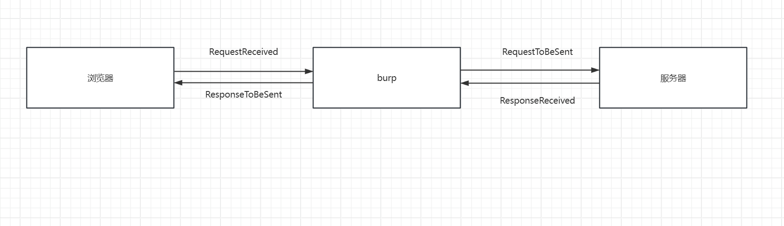

插件通过 hook 以上 4 个节点实现自动化加解密：

- **RequestReceived**：处理客户端到 Burp 的加密请求（解密）
- **RequestToBeSent**：处理 Burp 到服务器的明文请求（加密）
- **ResponseReceived**：处理服务器到 Burp 的加密响应（解密）
- **ResponseToBeSent**：处理 Burp 到客户端的明文响应（加密）


#### **配置步骤**

##### **插件基础配置**

- 勾选"启用加解密"
- 填写加解密接口地址（例如 `http://127.0.0.1:5000`）
- 配置目标域名（二级域名，如 `baidu.com`；`*` 或空表示所有域名）
- 点击"保存配置"生效

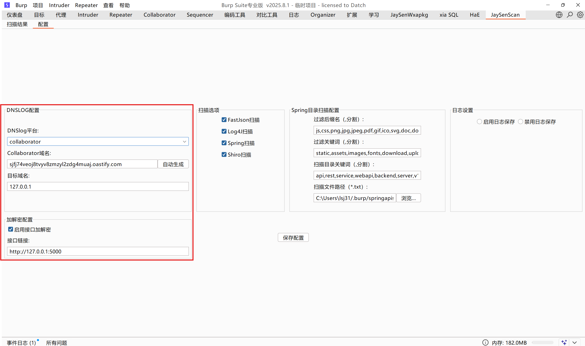


##### 【必看】在burp启动命令中添加参数

由于shiro550生产URLDns链子的需要，需要在启动burp的文件里加一行参数

我这里用的是.bat文件

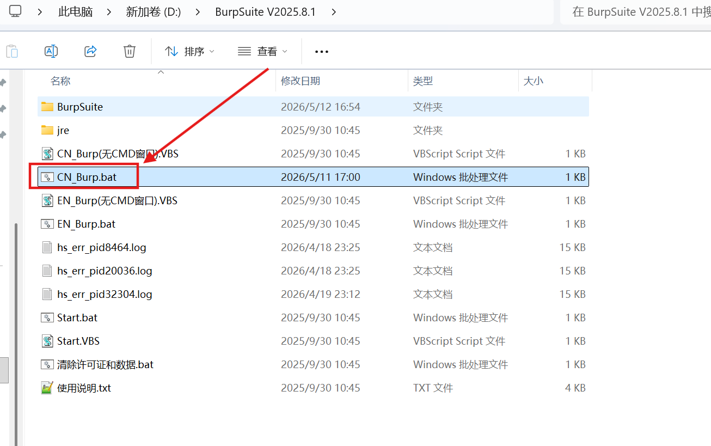

打开文件在-jar前添加参数（注意前后各一个空格） `--add-opens java.base/java.net=ALL-UNNAMED` 

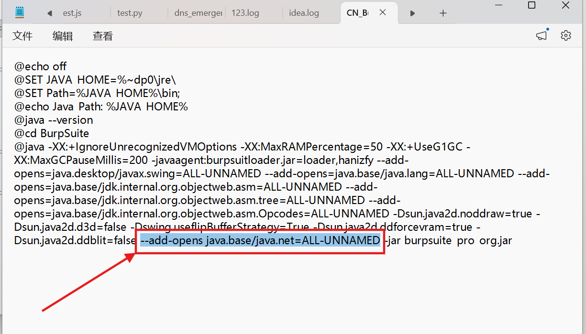

添加完成即可完美渗透shiro550/弱密钥了

##### **加解密接口实现**

需自行实现 HTTP 服务处理加解密逻辑，提供两个参考文件：

- `__jaysendata.py`（数据结构定义，无需修改）

```python
from dataclasses import dataclass
from typing import Dict

# 请求数据结构
@dataclass
class JaysenReqData:
    method: str                  # 请求方法（GET/POST等）
    paramters: Dict[str, str]    # 请求参数
    headers: Dict[str, str]      # 请求头
    body: str                    # 请求体

# 响应数据结构
@dataclass
class JaysenRespData:
    headers: Dict[str, str]      # 响应头
    body: str                    # 响应体
```

- `jaysenscan.py`（HTTP 服务示例，需在指定区域编写加解密逻辑）

```python
from flask import Flask, request, jsonify
from __jaysendata import JaysenReqData, JaysenRespData
app = Flask(__name__)

# 客户端→Burp：解密请求
@app.route('/RequestReceived', methods=['POST'])
def request_received():
    jaysendata = JaysenReqData(**request.get_json())
    # ============================编写解密逻辑============================
    # 示例：jaysendata.body = aes_decrypt(jaysendata.body)
    # ==================================================================
    return jsonify(jaysendata)

# Burp→服务器：加密请求
@app.route('/RequestToBeSent', methods=['POST'])
def handle_request():
    jaysendata = JaysenReqData(** request.get_json())
    # ============================编写加密逻辑============================
    # 示例：jaysendata.body = aes_encrypt(jaysendata.body)
    # ==================================================================
    return jsonify(jaysendata)

# 服务器→Burp：解密响应
@app.route('/ResponseReceived', methods=['POST'])
def ResponseReceived():
    jaysendata = JaysenRespData(**request.get_json())
    # ============================编写解密逻辑============================
    # ==================================================================
    return jsonify(jaysendata)

# Burp→客户端：加密响应
@app.route('/ResponseToBeSent', methods=['POST'])
def ResponseToBeSent():
    jaysendata = JaysenRespData(** request.get_json())
    # ============================编写加密逻辑============================
    # ==================================================================
    return jsonify(jaysendata)

if __name__ == '__main__':
    app.run(host='127.0.0.1', port=5000, debug=True)
```

> 提示：仅需在 `#=================` 标记区域编写加解密逻辑，任意语言都可以，只要能这四个接口


### 漏洞扫描

#### 基础配置

1. 配置 DNSlog 服务（支持 Burp Collaborator 或 CEYE）
   - 专业版 Burp 可使用 Collaborator（需点击"自动生成域名"）
   - 社区版需使用 CEYE 并填写 API 信息
2. 勾选需要启用的漏洞扫描类型（Fastjson / Log4j / Spring / Shiro）
3. 点击"保存配置"

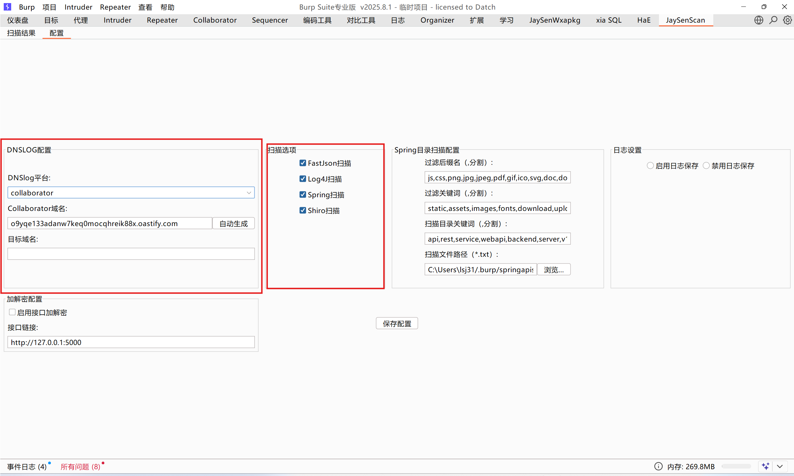
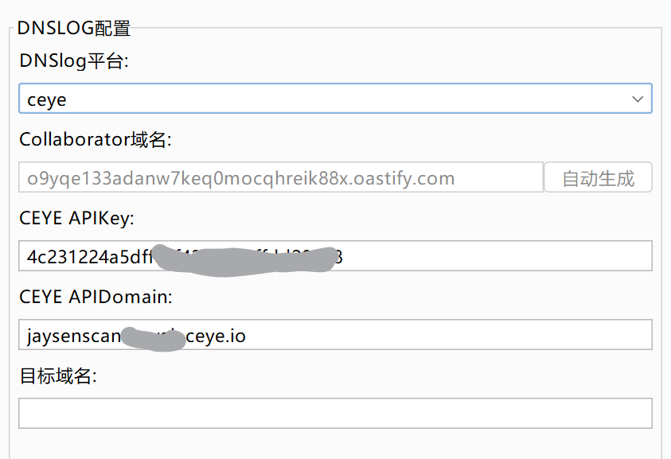

然后在Spring目录扫描配置框内有两个框，分别是**过滤后缀名**、**过滤关键词**

【！！！】意思就是这个插件的加解密功能、漏扫功能都不会经过指定的后缀名/关键词


#### Spring 接口扫描

1. 配置扫描触发条件：路径包含指定关键词时执行扫描
2. 扫描路径文件：默认路径为 `C:\Users\$USER\.burp\springapiscan.txt`（内置常用路径）
3. 递归扫描：例如 `/api/a/b/c` 会触发 `/api/a/b/c`、`/api/a/b`、`/api/a`、`/api`、`/` 的扫描
4. 防重机制：5 分钟内不重复扫描同一路径

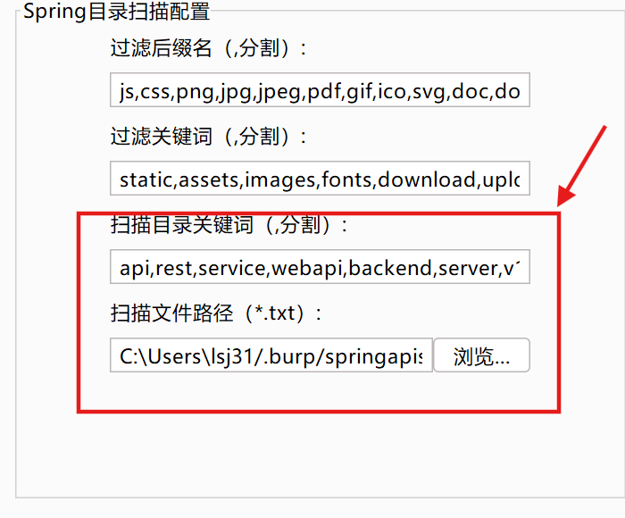
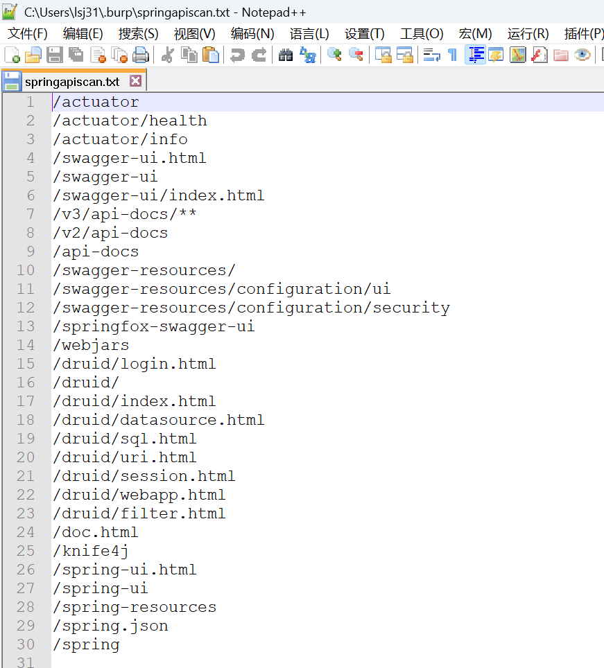


## 实战示例

提供专用靶场 [jaysenscandemo](https://github.com/Jaysen13/jaysenscandemo)，内置 5 个典型漏洞场景，帮助快速掌握插件使用。

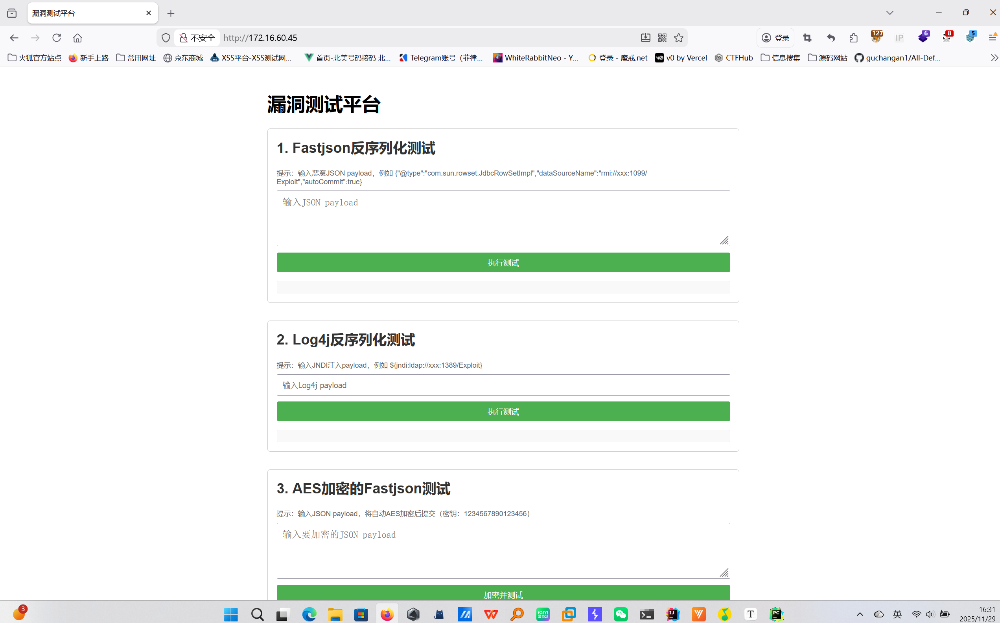


### 1. AES 加密的 Fastjson 漏洞检测

1. 启动靶场配套的 `Aes_FastJson.py` 加解密服务
2. 插件配置接口地址为 `http://127.0.0.1:5000`
3. 发送测试请求，Burp 自动解密显示明文
4. 插件自动生成加密后的检测 payload，通过 DNSlog 验证漏洞

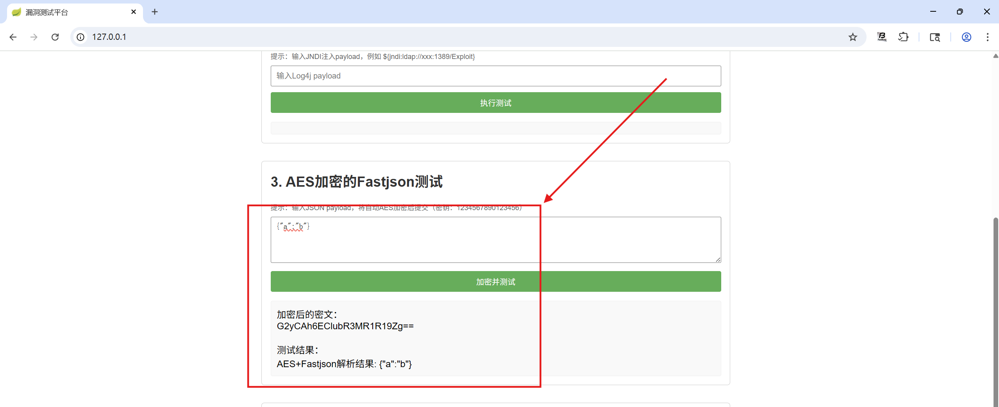

插件自动先将json数据替换为payload再按照我们指定好的加密后发送，dns接收到该次请求即可在扫描结果处看到

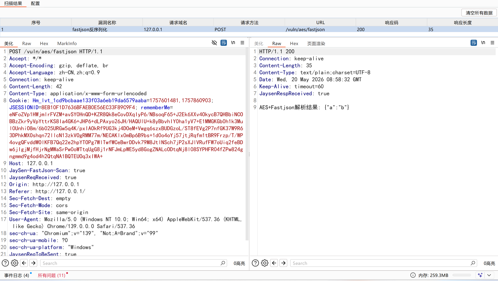


### 2. AES 加密的 Log4j 漏洞检测

1. 启动 `Aes_Log4j.py` 加解密服务
2. 发送含触发字符的请求，插件自动解密
3. 插件生成加密后的 Log4j payload 进行检测
4. 通过 DNSlog 监控命中情况确认漏洞

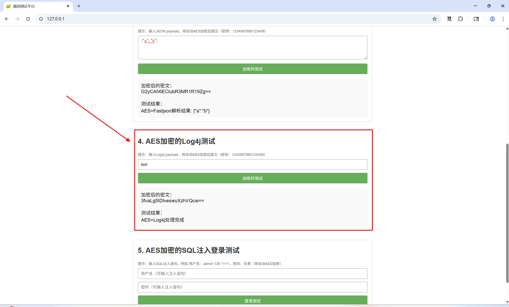

可以看见：log4j的payload自动加入post请求体参数内加密后传输加密，dns接收到该次请求即可在扫描结果处看到

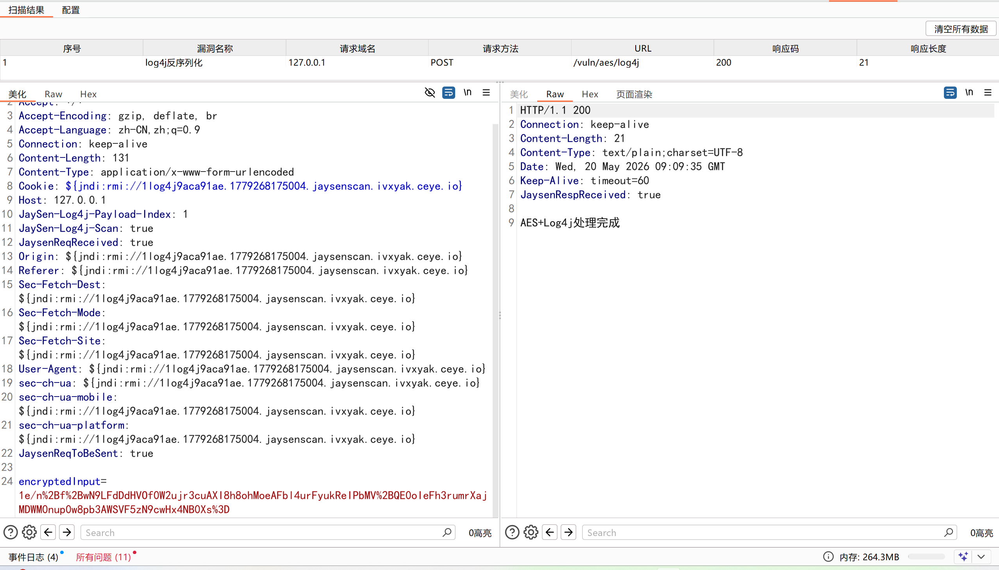


### 3. 联动 sqlmap 检测加密 SQL 注入

1. 启动 `Aes_Sql.py` 加解密服务

2. 抓取登录请求，获取解密后的明文数据

3. 将明文请求保存为 `data.txt`，通过 Burp 代理启动 sqlmap：

   ```shell
   python sqlmap.py -r data.txt --proxy=http://127.0.0.1:8080
   ```

4. sqlmap 发送的 payload 经插件自动加密，成功检测出注入点

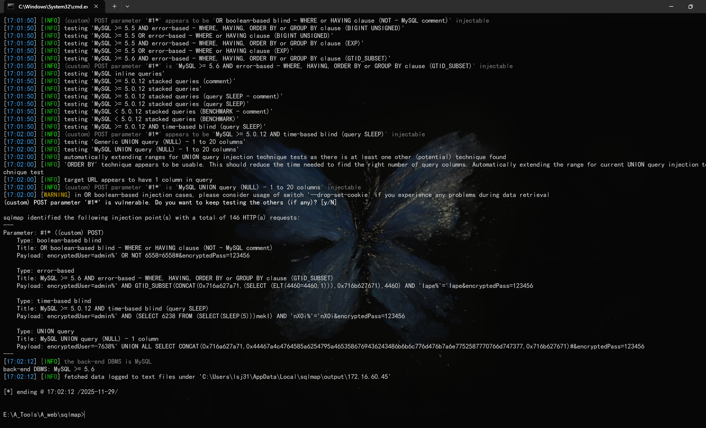

### 4. Shiro 反序列化与权限绕过检测

#### Shiro550 检测

1. 确保已配置 DNSLog 服务（Collaborator 或 CEYE）
2. 插件在识别到目标为 Shiro 框架后，自动遍历内置的 shiro_keys 字典（存储于 `~/.burp/shirokeys.txt`）
3. 通过构造加密的 URLDNS 载荷发送请求，DNSLog 平台收到回显即确认漏洞

#### Shiro721 检测

1. 前提：目标请求中需已有合法的 `rememberMe` cookie（用户已登录）
2. 插件篡改密文末尾字节，通过 `Set-Cookie: rememberMe=deleteMe` 响应判断 Padding Oracle 是否存在
3. 在无密钥情况下，利用 Padding Oracle 通道即可解密/重加密，最终达到反序列化 RCE

#### Shiro 权限绕过

1. 插件自动构造绕过 Payload（如 `/..;/`、`/;/`、`/%20/` 等）
2. 通过与原始请求的响应差异对比，识别权限绕过漏洞

> shiro550 找到的密钥会标注在请求头 `JaySen-shiroKey` 中，方便后续使用工具找链利用

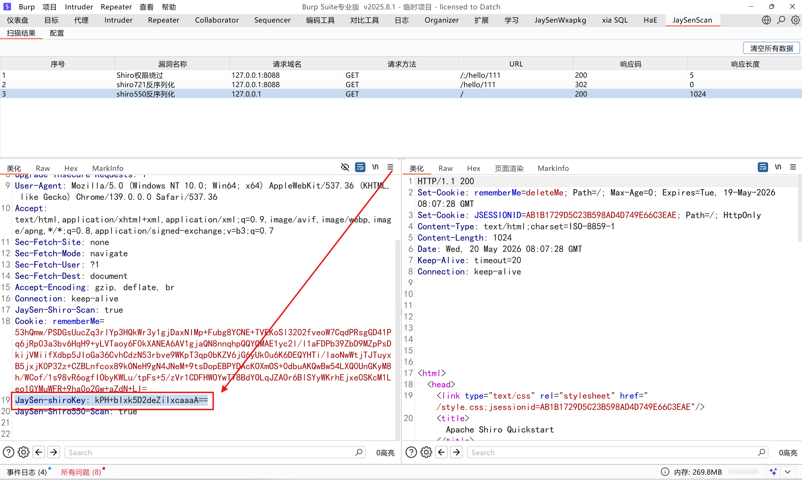

### 5. Spring 接口未授权访问检测

1. 在`Spring目录扫描配置`中配置过滤后缀名和关键词，避免对静态资源发起扫描
2. 插件从 `~/.burp/springapiscan.txt` 加载常见的 Spring 接口路径（如 `/actuator`、`/swagger-ui.html`、`/druid/`、`/doc.html` 等）
3. 递归扫描：从当前路径逐层向上拼接 Payload，如 `/api/user/list` 会依次扫描 `/api/user/list/actuator` → `/api/user/actuator` → `/api/actuator` → `/actuator`
4. 命中时自动标记为 "Spring未授权访问"


## 实用技巧

- 开启 Burp "显示编辑后的数据"选项，直接查看解密内容（如图）
  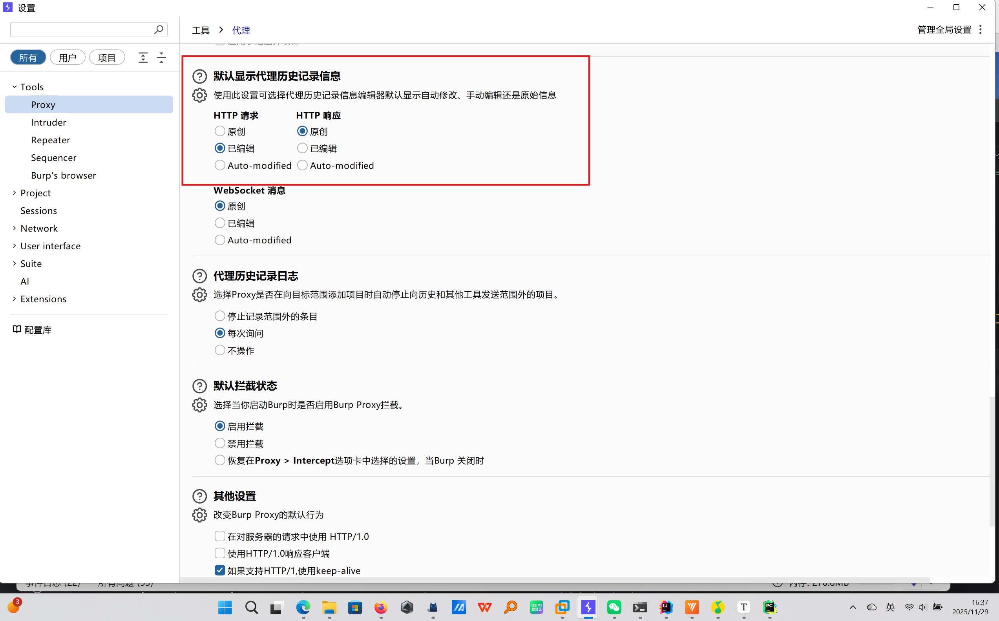
- 加解密接口支持 Java/Go/Node.js 等任意语言，只需保持 JSON 格式一致
- 扫描记录自动留存，可在插件历史面板查询


## 常见问题

- **Q：加解密接口必须用 Python 吗？**  
  A：不需要，支持任何语言，只要实现相同的 HTTP 接口即可。

- **Q：社区版 Burp 能否使用？**  
  A：可以，但不支持 Burp Collaborator，需配置 CEYE 作为 DNSlog 服务。

- **Q：加解密接口返回错误怎么办？**  
  A：检查接口地址是否正确、服务是否启动；查看 Burp Output 日志排查具体错误信息。

- **Q：为什么 Shiro550 扫描没有结果？**  
  A：确认三件事：① 已配置 DNSLog 服务；② Burp 启动命令已添加 `--add-opens java.base/java.net=ALL-UNNAMED` 参数；③ 密钥文件 `~/.burp/shirokeys.txt` 存在且内容非空。

- **Q：为什么 Shiro721 扫描没有触发？**  
  A：721 检测需要请求中已有合法的 `rememberMe` cookie（用户已登录），无 cookie 时会自动跳过。

- **Q：后续漏洞检测模块还会扩展吗？**  
  A：会的，师傅们可以留言

## 致谢

- [Galaxy](https://github.com/outlaws-bai/Galaxy) — 本项目加解密流量劫持与自动加解密的实现思路参考了 Galaxy 项目的 Hook 机制，在此感谢 [outlaws-bai](https://github.com/outlaws-bai) 的开源贡献。

## 作者与反馈

### 👨‍💻 作者信息

- 作者：JaySen

- 邮箱：3147330392@qq.com

- GitHub：[Jaysen13/JaySenScan](https://github.com/Jaysen13/JaySenScan)

- 微信公众号：**凌霜雁安全志**

  后续公众号会不定期分享网络安全类知识和工具推荐，欢迎关注~


### 📬 反馈与贡献

- 若遇到 Bug 或有功能建议，欢迎提交 GitHub Issue
- 插件持续迭代中，后续将支持更多漏洞类型检测

### 📄 许可证

本项目基于 CC BY-NC-SA 4.0 许可证开源：允许非商业使用、修改、分发（需保留原作者声明），**禁止任何形式的商业售卖**（含二开版本）。

⭐ Star 历史趋势

 如果这个项目对你有帮助，欢迎点亮 Star 支持一下！ 您的start，我的动力


<a href="https://www.star-history.com/?repos=Jaysen13%2Fjaysenscan&type=date&legend=top-left">

 <picture>
   <source media="(prefers-color-scheme: dark)" srcset="https://api.star-history.com/chart?repos=Jaysen13/jaysenscan&type=date&theme=dark&legend=top-left" />
   <source media="(prefers-color-scheme: light)" srcset="https://api.star-history.com/chart?repos=Jaysen13/jaysenscan&type=date&legend=top-left" />
   
 </picture>
</a>
